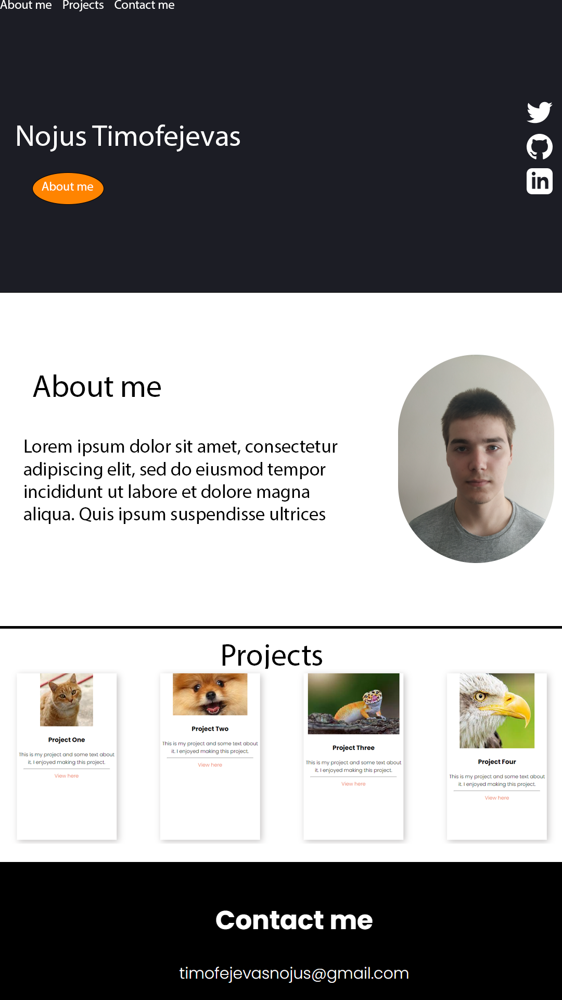
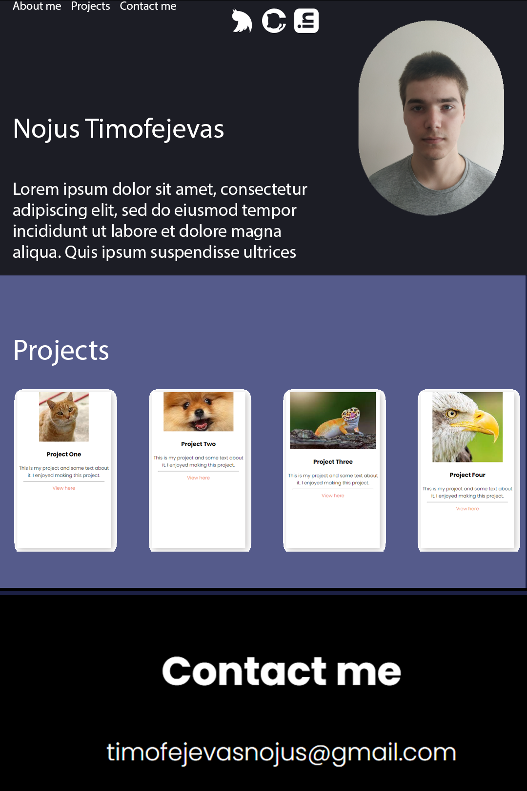

# Task 1

## 1

This Portfolio is aimed at an employer.
To hopefully persuade them to accept us to a specific position.
Hopefully the Digital Portfolio will be finished before the end of term.

## 2

* .1

* .2 

|   | About me | Contact me | Projects | Socials | Main Page |
|---|---|---|---|---|---|
| About me | &check; | &check; | &check; |  |  &check; |
| Contact me | &check; | &check; | &check;  |   | &check; |
| Projects | &check; |  &check; | &check; |   | &check; |
| Socials |  |   |   | &check; |  |
| Main page | &check; |  &check; | &check;  |   | &check; |

* .3 
https://www.youtube.com/watch?v=-D6oTPA4vXc

This design meets all requirements is tidy and looks comfortable

### Images
- Project images have been chosen at random as theres no projects i've accomplished yet

## Design one

## Design two

# Decision
I decided to keep the first design as it looks more modern and professional as well as not as compact as the second one which might overwhelm the employer/person of interest

|Testing that everything works||||||
|---|---|---|---|---|---|
| Redirects | &check; |
| hyperlinks | &check; |
| Images| &check; |
| Mobile/Scaling | &check; |
| Checked by Shaun Strachan that the Portfolio works on multiple different websites | &check; |

# Reviews of my Peers
### [Aiden] -
 When looking on the pages, I noticed a lack of interactibility with buttons. The colour scheme is really interesting and good for visibility and reading. The Contact Me section background colour could be the same as the first page colour to continue the colour scheme. The font is really nicely used and easy to read. 8/10 stars.

### [Adam] -
 When looking at your portfolio the colours look really pleasing however it could do with a little bit of colour, The about me page could be a little more detailed as well, you should include some skills and include some hobbies, you need to make the project buttons go to different projects not the same, i like the font and the font size its easy to read. 7/8 stars. 

### [Levente] -
 Personally i really like your website, the design is very unique and everything seems well done, what i would suggest you do is change the pictures so the lines under them are in a descending order(change the first and second picture) and to add some more writing to it. The font is easy to read and it suits the site, 8/10 stars.

### [Patryk] -
 I would agree with everyone about colour scheme, it really fits and unique. Description is fine, font is fine. What I would suggest is add more things in your projects as like Work Experience, Skills/Achviements & How you done with your U13. 6.5/10 stars.

### [Wiktoria] -
 I really like the colour scheme and how it's organised. It looks smart and pulled together. 10/10 stars.

### [Ash] -
 It looks really professional, all the links work which is really good. The only thing you need to fix in my opinion is that you need acounts on the links for socials i give it like 8.5/10 because it looks neat and clean but you need to improve on the socials thing. 8.5/10 Stars.

### [Samantha] -
  It looks really professional and all the links work, the colour is good but the only think need to add is accounts to social media but everything else is neat and clean and tidy. 9/10 stars.

### [Mitchell] -
 Im a big fan of the colour scheme for the portfolio, I also support the idea of the personal profile, it is a great introduction, I would just include a little bit more information on the personal profile, maybe something like what you like to do in your free time or what your hobbies are. The projects are a great way for showcasing your knowledge on coding and the grammar is fine. 9/10 Stars.

### [Herb] -
 Website looking pretty great so far but feels a bit bare in terms of content. Recommend that you show off more achievements/works you have done previously and maybe just expand on that. 8/10 Stars.

### [Daine] - 
 webpage functions good and looks great briliant navigation and easy to use and find contact information down at the bottom, over all a good digital portfolio. 8/10 stars.

### [Luke] -
 I like the colours that you have chosen and i like that the layout looks professional the navigation is smoothe and clean and everything works correctly. 8/10 Stars.

---
Aiden suggested to make the buttons more interactable so i decided to make them fade in/out when hovered over

I have turned down most other suggestions as they are either purely personal opinions or have no actual suggestions